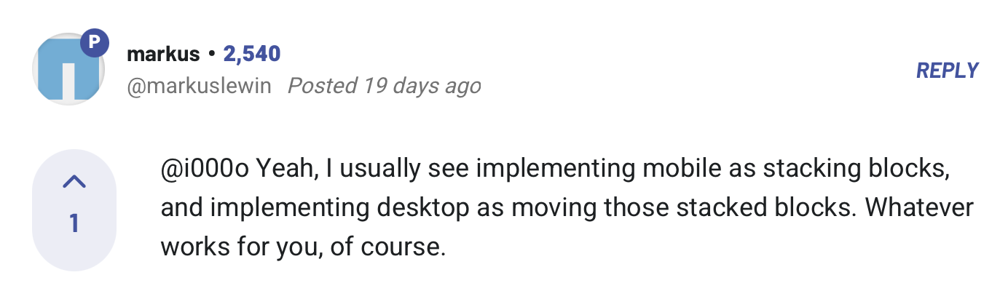

# Frontend Mentor - Huddle landing page with single introductory section solution

This is a solution to the [Huddle landing page with single introductory section challenge on Frontend Mentor](https://www.frontendmentor.io/challenges/huddle-landing-page-with-a-single-introductory-section-B_2Wvxgi0).

## Table of contents

- [Overview](#overview)
- [Goal](#goal)
- [Outcome](#outcome)
- [My process](#my-process)
- [Built with](#built-with)
- [Lessons](#lessons)
- [Take forward](#take-forward)
- [Useful resources](#useful-resources)

## Overview

This is a landing page for a fictional site called Huddle. I need to use HTML & CSS Flex to design this, and ensure it's responsive.

## Goal

My focus here is to use the confidence I've built designing simpler pages to tackle this more populated page. I think I'll be ready to start learning JavaScript soon.

## Outcome

:jigsaw: [Live Site URL](https://www.frontendmentor.io/profile/i000o)  
:pencil2: [Solution URL](https://www.frontendmentor.io/solutions/huddle-landing-page-with-sass-HqQ0AvxHhW)

## Built with

:gear: Semantic HTML5 markup  
:gear: CSS Flex
:gear: Mobile-first workflow  
:gear: Sass

## My process

:alien: I want to tackle this project a bit differently based on some feedback I've recently received which helped me. One developer encouraged me to return to a Mobile-first workflow and described their workflow in a way that inspired me to do so. See below:  
  
:alien: The other aspect I wanted to focus on was correcting my use of Sass nesting. Before, I was enjoying how organised this made my code, but I then began to rack up specificity errors where I couldn't make overrides in the media queries because of the way that something was nested. Although this made my Sass code visually organised, it made my `output.css` not DRY. I would unnecessarily, repeatedly target multiple selectors when I didn't need to. This lesson was also enriched by another piece of feedback I received around the same time which enlightened me as to how I wasn't using classes to their full potential and purpose. With these in mind, I wanted to make sure that my Sass code was even cleaner this time around.  
:alien: In order to improve this, once I'd gotten the base code down, I made a new branch called 'nesting' to make these changes without hurting my original code, in case I wanted to backtrack. When I'd tried to make quick nesting changes on projects before, it drastically affected things in a way that meant I'd have to spend more time on it, so I wanted to make a new branch for this so I could properly address it without fear of breaking my design.  
To do this, I took the opportunity to deepen my understanding of Git.  
:alien: I did some research on branches, merging pull requests etc. and learnt some new Git commands listed in [lessons](#lessons) to do so. This opened a new avenue of understanding of the Git process, which is always enjoyable and helps me to feel more empowered to control my code. I'll certainly be bringing this forward in future projects.  
:alien: I'm happy with the outcome of this project. At this point, I feel so much more confident in my ability to write strong HTML & CSS. When I see a design, I quickly know how to approach it and structure my code. I think I'm ready to integrate more interactivity into my projects and add a new language to my toolset - JavaScript.

## Questions

- How do I make the bg-img cover the space on scroll?

## Time taken

:alarm_clock: Mobile: 2 hrs
:alarm_clock: Desktop: 3 hrs

## Lessons

1. First time using `transition` property - I love the fades.
2. Git - `HEAD` is the current working branch we're in - Not necessarily main.
3. Git vs. SVN (Subversion).
4. I learnt how to make a new branch, switch to it, and issue pull requests! I did it from the command line using - `git branch nesting`, then `git checkout nesting` which switched to the branch, then `git add sass` to add my changed Sass folder, then `git commit -m "new branch test"`, then `git push origin nesting`! Although, I don't know what `origin` means in this context.
5. Finally learnt what the correct way to use `.wrapper` is - I didn't have a clear understanding of what this word referred to before.
6. First time using Font Awesome icons - I don't know if I like it. Is there a better alternative? Why are there spaces in the class names given. I can't seem to refer to individual children unless I use `nth-child()`.
7. From what I can see, `git switch` and `git checkout` do the same thing.
8. I merged changes for the first time using `git add .`, `git commit`, `git checkout main`, `git merge <nesting>` and then `git push`. I'm not fully clear on what `git fetch` and `git pull` does in this context but I'm learning.

## Take forward

:grey_exclamation: Making new branches to affect changes while preserving the original code!  
:grey_exclamation: `transition` property - I want to use this more.  
:grey_exclamation: I'm ready to start learning JavaScript...  
:grey_exclamation: I need to work on `background-image`. I still don't have the hang of it.

## Useful resources

[How TO - Social Media Buttons](https://www.w3schools.com/howto/howto_css_social_media_buttons.asp)
[Git – Head](https://www.geeksforgeeks.org/git-head/)
[Git vs. SVN: Which version control system is right for you?](https://nulab.com/learn/software-development/git-vs-svn-version-control-system/#:~:text=SVN%20workflow&text=It%20only%20includes%20tested%2C%20unbroken,and%20development%20in%20the%20branch.)
[Wrapper in CSS](https://www.geeksforgeeks.org/wrapper-in-css/)
[About branches - GitHub Documentation](https://docs.github.com/en/pull-requests/collaborating-with-pull-requests/proposing-changes-to-your-work-with-pull-requests/about-branches)
[Git Checkout](https://www.atlassian.com/git/tutorials/using-branches/git-checkout#:~:text=The%20git%20checkout%20command%20lets,new%20commits%20on%20that%20branch.)
[Creating a Git Pull Request Using the Command Line: A Detailed Guide](https://medium.com/@ravipatel.it/creating-a-git-pull-request-using-the-command-line-a-detailed-guide-4ef1ea017fe2)

# huddle-landing-page
